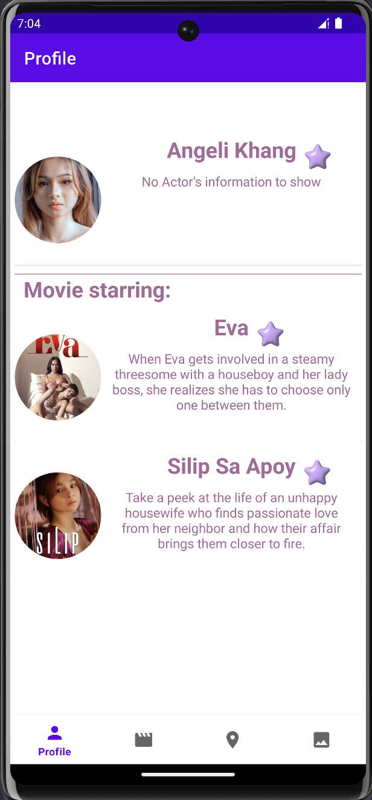
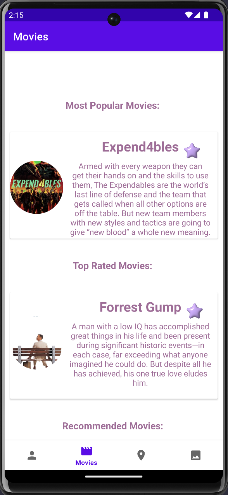
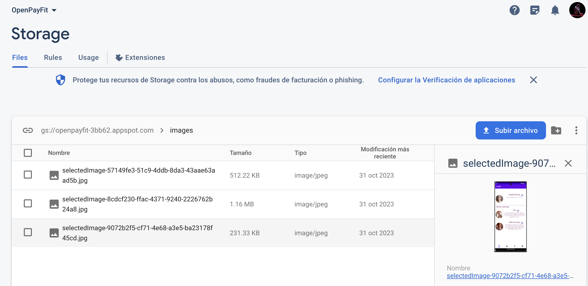

# OpenPayFit

Overview:
This Android application is built with the aim of utilizing several powerful libraries and architectural patterns to create a robust, scalable, and efficient system for managing data, network requests, and user interface interactions. The app leverages Room Database for local data storage, Lottie for animations, Retrofit for network requests, Glide for image loading, Firebase for additional functionalities, Hilt for dependency injection, and MockK for unit testing. The architecture follows MVVM (Model-View-ViewModel) combined with Clean Architecture principles.

Features:

Room Database:

Implements local storage and caching mechanism using Room Persistence Library to manage the app's database.

Retrofit:

Handles API requests efficiently and seamlessly with Retrofit, enabling communication with backend servers.

Glide:

Manages image loading and caching, ensuring smooth user experience when dealing with images.

Firebase:

Integrates Firebase services for additional functionalities like authentication, real-time database, cloud messaging, etc.
Hilt (Dependency Injection):

Implements Hilt for effective dependency injection, enabling easier testing, and providing better maintainability.
MockK (for unit testing):

Utilizes MockK for unit testing to ensure the reliability and stability of the codebase.

Architecture:
The app follows the MVVM architectural pattern, separating the UI, business logic, and data layers. Additionally, Clean Architecture principles are implemented, promoting separation of concerns and a clear, scalable code structure. The layers include:

Presentation Layer (View):
Handles UI logic and interactions.

ViewModel:
Manages the UI-related data and business logic.

Use Cases:
Executes business rules and contains application-specific business logic.

Repository:
Manages data operations, providing a clean API to the rest of the app.

Data Source:
Handles the data sources, such as local and remote data.

Overview:
This Android application is designed with four primary tabs to provide distinct functionalities and features.

Features by Tabs:

Profile:

Displays information about the most popular actor.
Shows a list of movies the actor stars in.

Movies:

Segregates movie information into three categories: most popular, top-rated, and recommended movies.
Recommended movies are based on the popularity of the most popular actor displayed in the Profile tab.

Location (Not Implemented):

Originally intended to retrieve and save the device's location every 5 minutes.
Due to time constraints, this feature remains unimplemented.

Image Uploader (Gallery to Firebase):

Allows users to upload images from their device's gallery to Firebase storage.

Possible Enhancements:

Unit Testing Coverage Improvement:

Expand unit test coverage to ensure a more comprehensive and robust testing suite for all modules and functionalities.
Write additional test cases to cover various scenarios and edge cases for better code reliability.
Proper Utilization of Empty States and Loaders:

Implement and display appropriate empty states for scenarios where no data is available, enhancing the user experience and providing context.
Integrate loaders and loading indicators where applicable to provide visual feedback during data retrieval or processing.
UI Improvements:

Enhance the user interface by improving layout, design, and overall aesthetics for a more intuitive and visually appealing user experience.
Optimize UI elements, ensuring consistent design patterns and adherence to Material Design guidelines.

